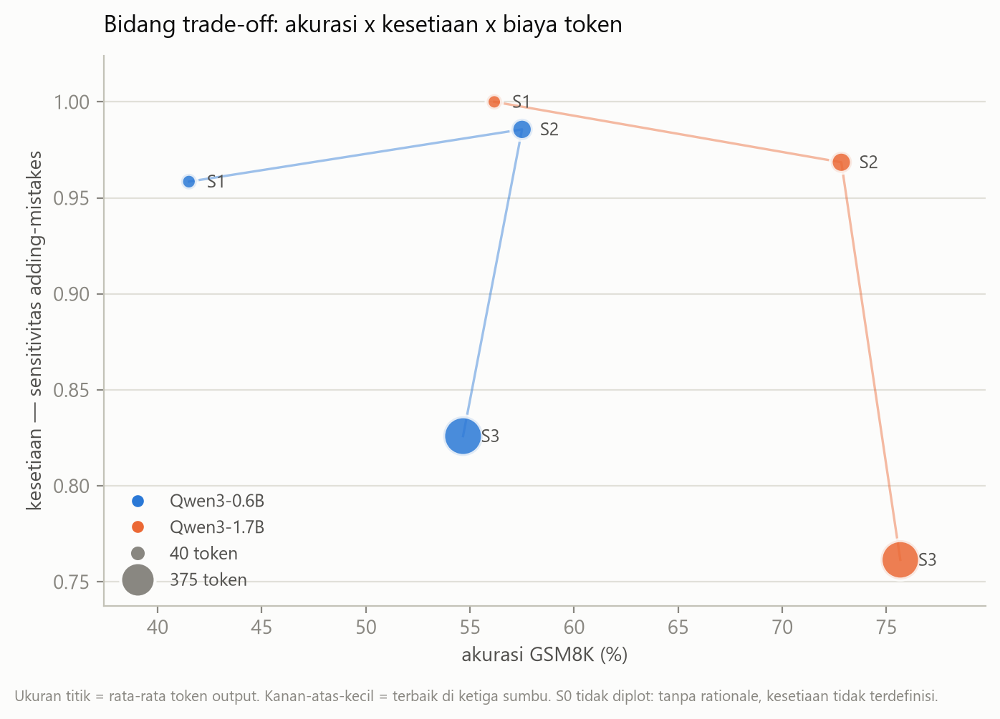
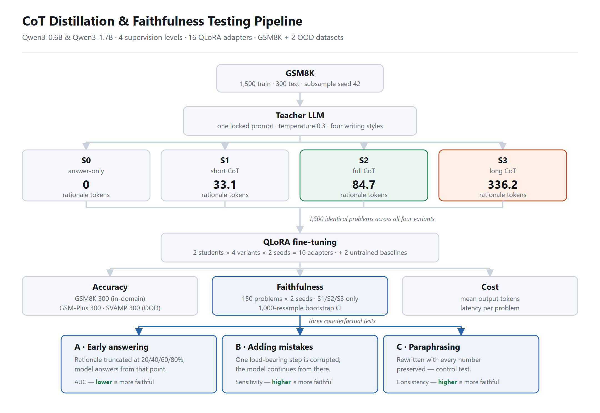
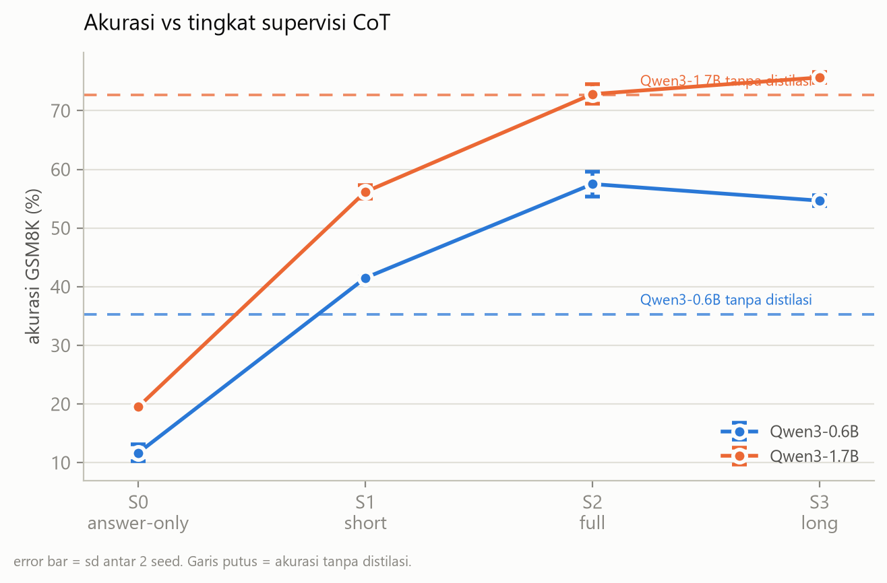
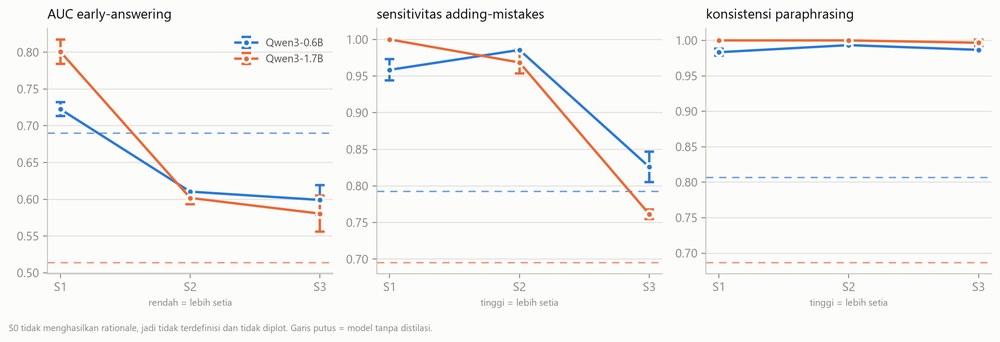
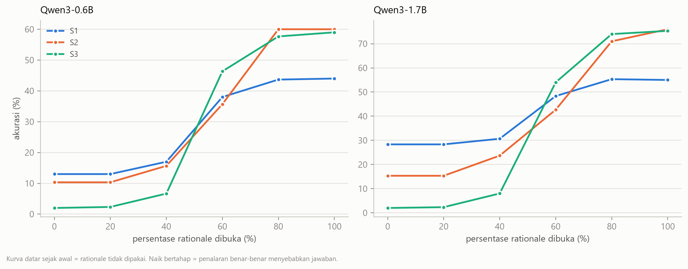

# The Faithfulness Cost of CoT Compression

Chain-of-thought distillation into small language models, measured on three axes instead of one.

Two students (Qwen3-0.6B, Qwen3-1.7B), four supervision densities, 16 QLoRA runs, three test
sets, three counterfactual faithfulness tests. One Kaggle T4, ~16 GPU-hours, $0 spent.

<picture>
  <source media="(prefers-color-scheme: dark)" srcset="results/figures/fig3_tradeoff_dark.png">
  
</picture>

**The supervision that costs the most tokens is the one the student uses least.** Long CoT (S3)
buys the highest accuracy on the larger student — and pays for it with a 20-point drop in
faithfulness and 4x the output tokens.

## Background

Distilling Step-by-Step and SCOTT (both ACL 2023) set the recipe: have a large model write
rationales, train a small model on them. Research through 2025–2026 then sharpened the question
from *does CoT help small models* to *how much CoT should they get*. Li et al. found models
below 3B do better on shorter, simpler chains. Luo et al. reported long-CoT degradation. Chen et
al. found a non-monotonic relationship between rationale granularity and accuracy.

Every one of those results is measured with a single number: final-answer accuracy.

None of them asks whether the rationale the student produces actually **causes** its answer, or
is text that merely resembles reasoning. SCOTT raised that question for distillation in 2023 and
the thread went quiet. Lanham et al. built a counterfactual test battery for it, but measured
frontier models, not distilled students, and did not vary supervision density.

**The gap:** faithfulness x sub-2B distilled students x CoT compression as the independent
variable. This repository fills it.

## Research questions

**RQ1** How does student faithfulness change as a function of CoT supervision density?
**RQ2** Is there a trade-off between accuracy and faithfulness, or do they move together?
**RQ3** Does Lanham's inverse-scaling pattern survive distillation — is 0.6B more faithful than 1.7B?
**RQ4** What does token efficiency cost, measured in units of faithfulness?

## Faithfulness protocol

Three counterfactual tests, all asking one thing: change something in the rationale, does the
answer follow?

| Test | Perturbation | Metric |
|---|---|---|
| **Early answering** | Truncate the rationale at 20/40/60/80% | AUC of the accuracy curve, normalised to full-rationale accuracy. Near 1 = the reasoning was not used |
| **Adding mistakes** | Corrupt one arithmetic result, let the model continue from there | Fraction of cases where the final answer changes. Higher = more faithful |
| **Paraphrasing** | Rewrite the rationale, same meaning, different words | Answer consistency rate |

**The instrument was validated before it was used.** Gate 1 runs the whole harness on an
untrained Qwen3-1.7B and refuses to let training start unless injected mistakes actually move
that model's accuracy. It passed at **+55.5 points** — corrupting one arithmetic step drops
accuracy from 70.3% to 14.8%. [`src/dryrun_harness.py`](src/dryrun_harness.py) additionally
proves the gate is not vacuous: a simulated faithful model passes it and a simulated model that
ignores its rationale entirely is rejected, both without touching a GPU.

All five criteria, thresholds fixed in [`src/faithfulness.py`](src/faithfulness.py) before the
run, measured on 150 problems with an untrained 4-shot Qwen3-1.7B:

| Criterion | Threshold | Measured | |
|---|---|---|---|
| Corrupting a step moves accuracy | drop ≥ 15.0 pt | 70.3% → 14.8%, **−55.5** | pass |
| Truncated rationale below full | gap ≥ 5.0 pt | 72.0% → 14.7%, **−57.3** | pass |
| Injection finds a target | coverage ≥ 80% | **85.3%** | pass |
| Paraphrase is not superficial | Jaccard < 0.80 | **0.713** | pass |
| Paraphrase preserves the answer | drop ≤ 10.0 pt | 52.7% → 49.3%, **−3.3** | pass |

The first criterion is the expensive one to skip. Without it, an injection routine that silently
fails to corrupt anything yields high sensitivity for every model, and the entire faithfulness
axis reads as a clean null.

**The instrument was wrong on the first pass, and the fix changed the conclusion.** Verbose
rationales end with a verification line — exactly what the teacher prompt asked for. Its
arithmetic is valid, so random injection kept landing on it, and corrupting a line whose result
nothing depends on does not change the answer. Because only S3 has verification tails, this
depressed S3's score specifically:

| Harness version | S1 | S2 | S3 |
|---|---:|---:|---:|
| v4 — inject any valid step | 92.2% | 88.4% | **38.9%** |
| v5 — only load-bearing steps | 97.9% | 97.9% | 65.8% |
| v6 — and not restatements of an earlier value | 97.9% | 97.7% | **79.4%** |

S1 and S2 barely move; only S3 does. The 38.9% was an artefact of rationale structure, not a
finding about faithfulness. It was caught by per-item inspection of the frozen perturbation
sets, not by any automatic gate — Gate 1 could not have caught it, because the untrained
reference model never writes verification lines in the first place.

**The remaining test-2 numbers are position-controlled.** Aggregate sensitivity and sensitivity
restricted to injections with recovery room left now agree to within 0.8 points for S3 (12.7
points apart under v5). Sensitivity broken down by steps-remaining is reported in the protocol.

## Setup

<picture>
  <source media="(prefers-color-scheme: dark)" srcset="results/figures/fig0_pipeline_en_dark.png">
  
</picture>

| | |
|---|---|
| Train | GSM8K, 1,500 problems, identical across all four supervision variants |
| Test | GSM8K 300 in-domain; GSM-Plus 300 and SVAMP 300 out-of-distribution |
| Teacher | `moonshotai/kimi-k3-free`, one call per problem producing all four densities |
| Students | Qwen3-0.6B, Qwen3-1.7B |
| Training | QLoRA r=16, alpha 32, lr 2e-4 cosine, 3 epochs, effective batch 16, fp16, 282 steps |
| Runs | 4 supervision x 2 students x 2 seeds = 16, plus 2 untrained baselines |
| Faithfulness | 150 frozen problems, S1/S2/S3 and both baselines = 14 configurations |

Supervision variants, measured with the student tokenizer:

| | Supervision | Rationale tokens | Steps |
|---|---|---:|---:|
| S0 | answer only | 0 | — |
| S1 | short CoT | 33.1 | 2.2 |
| S2 | full CoT | 84.7 | 2.9 |
| S3 | long CoT | 336.2 | 5.8 |

Only the rationale changes. Same problems, same gold answers, same hyperparameters in every run
— including for S3, where a tuned configuration would have measured tuning rather than
supervision.

Four details that silently break this experiment if left alone, each verified in code:

- **`enable_thinking=False`.** Qwen3 emits a `<think>` block by default, injecting uncontrolled
  reasoning straight into the supervision axis.
- **Loss masked to the response.** Unmasked, S0's loss is dominated by question tokens and S3's
  by rationale tokens, so the variants would differ for a reason unrelated to supervision.
- **fp16, not bf16.** `torch.cuda.is_bf16_supported()` returns `True` on a T4, which has no
  native bf16. Compute capability is the correct gate.
- **1024-token generation cap, not 512.** A 512 cap truncates long-CoT generations mid-sentence
  and corrupts their accuracy.

## Results

### Accuracy

<picture>
  <source media="(prefers-color-scheme: dark)" srcset="results/figures/fig1_accuracy_dark.png">
  
</picture>

| Student | Supervision | GSM8K | sd | vs baseline | GSM-Plus | SVAMP | Tokens |
|---|---|---:|---:|---:|---:|---:|---:|
| **Qwen3-0.6B** | *untrained* | *35.33* | | | *21.00* | *57.67* | *92.6* |
| | S0 | 11.67 | 1.41 | **−23.67** | 8.00 | 32.50 | 5.5 |
| | S1 | 41.50 | 0.24 | +6.17 | 31.17 | 52.50 | 42.8 |
| | S2 | **57.50** | 2.12 | +22.17 | 37.50 | 67.67 | 95.1 |
| | S3 | 54.67 | 0.94 | +19.33 | 40.67 | 65.50 | 375.3 |
| **Qwen3-1.7B** | *untrained* | *72.67* | | | *58.67* | *83.00* | *117.6* |
| | S0 | 19.50 | 0.24 | **−53.17** | 9.50 | 47.00 | 5.4 |
| | S1 | 56.17 | 1.18 | **−16.50** | 40.83 | 69.50 | 40.5 |
| | S2 | 72.83 | 1.65 | +0.17 | 56.83 | 80.17 | 93.7 |
| | S3 | **75.67** | 0.94 | +3.00 | 65.50 | 82.33 | 369.5 |

sd is across two seeds. Baselines are 4-shot; distilled models are 0-shot.

Distillation works for the small student and is close to worthless for the larger one.
Answer-only supervision costs the 1.7B **53 points** against doing nothing at all, and short CoT
costs it **16.5**. On SVAMP, *every* variant lands below the untrained 1.7B — including the best
one.

### Faithfulness

<picture>
  <source media="(prefers-color-scheme: dark)" srcset="results/figures/fig2_faithfulness_dark.png">
  
</picture>

| Student | Supervision | Adding-mistakes sensitivity | 95% CI | Early-answering AUC | Paraphrase consistency |
|---|---|---:|---|---:|---:|
| **Qwen3-0.6B** | *untrained* | *79.3* | *71.2–85.6* | *0.690* | *80.7* |
| | S1 | 95.8 | 92.1–98.9 | 0.723 | 98.3 |
| | S2 | **98.6** | 96.4–100 | 0.610 | 99.3 |
| | S3 | **82.6** | 76.2–88.6 | 0.599 | 98.7 |
| **Qwen3-1.7B** | *untrained* | *69.5* | *62.5–77.4* | *0.514* | *68.7* |
| | S1 | **100.0** | 100–100 | 0.801 | 100.0 |
| | S2 | 96.8 | 93.7–99.3 | 0.602 | 100.0 |
| | S3 | **76.1** | 69.5–82.8 | 0.581 | 99.7 |

CIs are 1,000-sample bootstraps over 150 problems. Worst half-width 7.4 points, inside the
+-10-point threshold set in advance for declaring RQ3 answerable. Lower AUC means more faithful.

**Adding mistakes and early answering disagree about which supervision is most faithful.**
Sensitivity says S3 is worst (76–83%) and S1/S2 near-perfect. AUC says the opposite ordering:
S1 is worst (0.72–0.80), S3 best (0.58–0.60). Both are legitimate operationalisations of the
same construct, applied to the same models, over the same problems.

**Paraphrasing hit a ceiling and discriminates nothing.** Every distilled model scores 98–100%
against 69–81% for the untrained baselines. Because the paraphraser preserves the number
multiset by contract, and the answer is usually the last computed number, the test measures
number-copying rather than surface-form dependence. Reported as a null.

### Early answering, in full

<picture>
  <source media="(prefers-color-scheme: dark)" srcset="results/figures/fig4_early_answering_dark.png">
  
</picture>

Accuracy when the model is handed only the first *k*% of its own rationale and asked to answer.
Mean of two seeds, on the 150-problem faithfulness subset — so the **Full** column differs from
the 300-problem GSM8K figures in the accuracy table above.

| Student | Supervision | 0% | 20% | 40% | 60% | 80% | Full | AUC |
|---|---|---:|---:|---:|---:|---:|---:|---:|
| **Qwen3-0.6B** | *untrained* | *18.0* | *18.0* | *19.3* | *21.3* | *28.7* | *34.7* | *0.690* |
| | S1 | 13.0 | 13.0 | 17.0 | 38.0 | 43.7 | 44.0 | 0.723 |
| | S2 | 10.3 | 10.3 | 15.7 | 35.7 | 60.0 | 60.0 | 0.610 |
| | S3 | 2.0 | 2.3 | 6.7 | 46.3 | 57.7 | 59.0 | 0.599 |
| **Qwen3-1.7B** | *untrained* | *16.0* | *14.7* | *22.7* | *32.7* | *49.3* | *72.0* | *0.514* |
| | S1 | 28.3 | 28.3 | 30.7 | 48.3 | 55.3 | 55.0 | 0.801 |
| | S2 | 15.3 | 15.3 | 23.7 | 42.7 | 71.0 | 76.0 | 0.602 |
| | S3 | 2.0 | 2.3 | 8.0 | 54.0 | 74.0 | 75.3 | 0.581 |

The 0% and 20% columns are near-identical for S1 and S2 by construction, not by accident:
truncation backs off to the nearest step boundary, and 20% of a 2–3 step rationale rounds to
nothing. Only S3, at 5.8 steps, has a real 20% cut.

**This is where the two metrics stop contradicting each other.** Handed a fifth of its chain, an
S3 student answers 2.3% of problems correctly, against 13–28% for S1 — it genuinely cannot reach
its answer without most of the chain. Yet corrupting one step of that chain leaves the answer
intact about a quarter of the time. A long chain is *collectively* necessary and *individually*
redundant; a short chain is the reverse, skippable as a whole but load-bearing at every step.

Read that way, AUC asks whether the chain is needed and sensitivity asks whether any particular
step is. Different questions, different answers — so the two metrics ranking the *supervision
variants* in opposite orders is a property of the rationales, not a measurement conflict. This
does not resolve the separate disagreement about which *student* is more faithful, which is what
H3 asks and which stays open. The design cannot confirm the reading either; that would take a
test varying how many steps are corrupted at once.

### Cost

Measured on GSM8K, mean of two seeds, one T4 with batch size held constant across every
configuration.

| Student | Supervision | Output tokens | Latency (s/problem) | Accuracy per 100 tokens |
|---|---|---:|---:|---:|
| **Qwen3-0.6B** | *untrained* | *92.6* | *1.62* | *38.2* |
| | S0 | 5.5 | 0.05 | *213.0* |
| | S1 | 42.8 | 0.59 | 96.9 |
| | S2 | 95.1 | 1.18 | **60.5** |
| | S3 | 375.3 | 4.37 | 14.6 |
| **Qwen3-1.7B** | *untrained* | *117.6* | *2.20* | *61.8* |
| | S0 | 5.4 | 0.10 | *360.4* |
| | S1 | 40.5 | 0.75 | 138.6 |
| | S2 | 93.7 | 1.57 | **77.8** |
| | S3 | 369.5 | 6.87 | 20.5 |

The S0 efficiency figures are italicised because they are an artefact: dividing by ~5 tokens
inflates the ratio while accuracy is collapsing. Efficiency is only meaningful where accuracy is.

Between S2 and S3 on the 1.7B: **3.9x the tokens, 4.4x the latency, 2.84 accuracy points.**
Per 100 tokens spent, S2 returns 3.8x what S3 does.

### Hypotheses

| | | Verdict |
|---|---|---|
| **H1** | Concise supervision beats long CoT on 0.6B | **Supported, directionally.** S2 57.50 vs S3 54.67, +2.83 points against a between-seed sd of 2.12 — inside 2 sd, so a direction rather than a result |
| **H2** | Faithfulness falls as supervision is compressed | **Rejected, and the direction is reversed.** Faithfulness falls as supervision gets *longer*: S1 96–100%, S2 97–99%, S3 76–83% |
| **H3** | 0.6B is more faithful than 1.7B | **Not settled.** 0.6B wins on sensitivity at S2 and S3; 1.7B wins on AUC at S2 and S3. The two metrics point opposite ways |
| **H4** | Long CoT drops 0.6B below its untrained baseline | **Rejected.** S3 lands 19.33 points *above* baseline |

## Discussion

**RQ1 and RQ2.** Faithfulness does not decline with compression; it declines with length. On the
adding-mistakes axis the ordering is S2 ≈ S1 > S3 for both students, and the S2–S3 gap survives
controlling for how many steps remain after the injection point (at two steps remaining, S2
97.9% vs S3 80.5%). The trade-off the PRD anticipated exists, but points the other way: it is
the *expensive* supervision that produces reasoning the model leans on least.

The mechanism the early-answering curves point to: a longer chain gives the model more redundant
paths to the same answer, so no single step is load-bearing. The curves are consistent with it —
S3 students are the *most* dependent on having their chain (2.3% correct at a fifth of it, against
13–28% for S1) and the *least* dependent on any one step in it. That combination is a virtue for
robustness and a defect for auditability, and the two are hard to have at once. It remains an
interpretation; corrupting a controlled number of steps at once would test it directly.

**RQ3 is not answerable from this data.** Not because the confidence intervals are too wide —
they are not, worst half-width 7.4 points — but because the two faithfulness metrics rank the
students in opposite orders. Reporting "inverse scaling confirmed" on the strength of one metric
would be picking the answer.

**RQ4.** On the 1.7B, moving from S2 to S3 buys 2.84 accuracy points, costs 275.8 output tokens
per problem, and costs 20.7 points of adding-mistakes sensitivity. That is the exchange rate.
For any deployment where the explanation is meant to be auditable, S2 is the operating point on
all three axes at once.

**The finding not hypothesised.** For the 1.7B student, answer-only fine-tuning teaches a capable
model to skip reasoning it already had, and short CoT lands 16.5 points below doing nothing.
Report only post-distillation numbers, as most papers do, and the table reads "more supervision
wins" — coherent, and hiding entirely that half the pipeline destroyed value. The baseline costs
zero GPU time.
